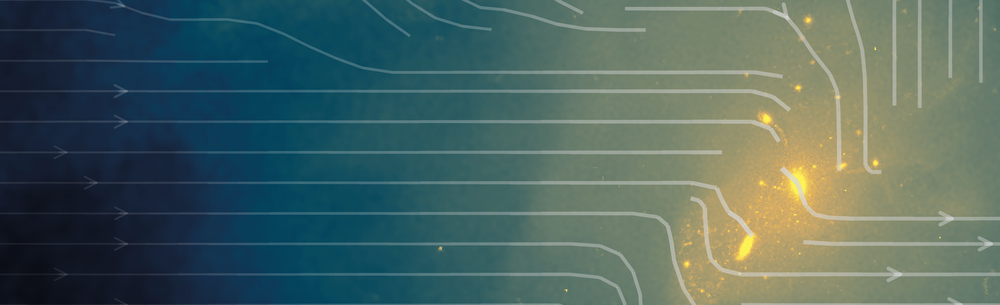
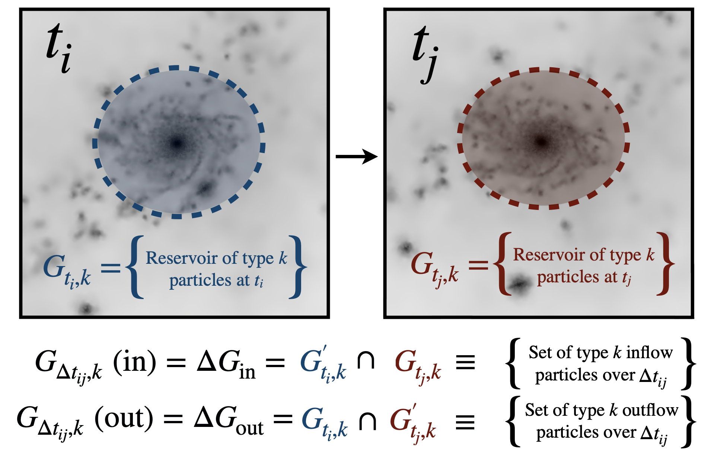

# HYDROFLOW – GAS FLOWS IN COSMOLOGICAL SIMULATIONS
### *Ruby Wright (2021)*

Tools for Lagrangian and Eulerian analysis of gas flows in hydrodynamical simulations. This repository contains code to generalise the analysis of gas flows to and from large samples of haloes and galaxies. 

Image generated with Py-SPHViewer (Benitez-Llambay, 2015) and the EAGLE simulations (Schaye, 2015).

## Lagrangian calculations
This code includes routines to calculate Lagrangian flow rates over a given boundary. This requires that any particle or element represents the same ``parcel'' of matter from snapshot to snapshot. If we determine the set of particles constituting a given reservoir (e.g. a galaxy, a halo) at two snapshots $i$ and $j$ ($G_{t_{i},k}$  and $G_{t_{j},k}$ respectively; where snapshot $j$ is subsequent to snapshot $i$) –  it is possible to compare these sets and determine which particles have joined or left the structure of interest over the desired time interval, $\Delta t_{\rm ij}$. The particles that were not part of the reservoir at set $i$  but joined the reservoir at snapshot $j$ can be considered Lagrangian "inflow particles" – defining the set $G_{\Delta t_{ij},k}\ ({\rm in})$; or $\Delta G_{\rm in}$ for brevity. Similarly, particles that were part of the reservoir at set $i$ but left the reservoir at snapshot $j$ can be considered Lagrangian "outflow" particles – defining the set $G_{\Delta t_{ij},k}\ ({\rm out})$; or $\Delta G_{\rm out}$ for brevity.

The average mass inflow or outflow rate of a given structure $G$ can be calculated by summing all particle masses, $m_{p}$, constituting the inflow or outflow sets, and normalising by the relevant time interval:

$$\dot{M}_{G}=\sum_{p\in\Delta G}m_{p}/\Delta\,t_{ij}$$

Where $m_{p}$ is the mass of a particle $p$, and $\Delta G$ can refer to the inflow or outflow set. Such a calculation corresponds to a *gross* inflow or outflow rate, with the difference between these two reflecting the *net* change. In the case of gas particle flow rates, it is important to also include any stellar particles that were formed between $t_{\rm i}$ and $t_{\rm j}$ in the $\Delta G$ sets. This can be achieved by simply ensuring that a particle is gaseous at the initial snapshot, $t_{i}$; but not necessarily enforcing this requirement at  $t_{j}$. With a method for identifying the set of particles constituting the inflow and outflow sets, $\Delta G$, it is then also possible to characterise the properties of the $\Delta G$ sets (e.g. for their metallicity, temperature, density etc.).

Images generated with Py-SPHViewer (Benitez-Llambay, 2015) and the EAGLE simulations (Schaye, 2015).

## Eulerian calculations
This code also includes routines to calculate (instantaneous) Eulerian gas flow rates at a given boundary. This does not require that any particle or element represents the same ``parcel'' of matter from snapshot to snapshot. Eulerian-based mass flow rates can be calculated at a given boundary by categorising relevant boundary particles/elements as being either outflow or inflow depending on the sign of their radial velocity -- where the radial velocity of a particle/element $i$ relative to a halo center $j$ can be calculated as $v_{{\rm\,r},\,ij}=\vec{{v}_{ij}}\vec{{r}_{ij}}/\lvert\vec{{r}_{ij}}\rvert$. Then, inflow or outflow rate at shell $r=R$ around halo $j$ for each of these subsets of boundary gas elements, $i\in k$, can be calculated follows:

$$\dot{M}_{k}(r=R)=\frac{1}{\Delta\,r}\times\sum_{i\in k}\left(m_{i}\frac{{\vec{v}_{ij}}\vec{{r}_{ij}}}{\lvert\vec{{r}_{ij}}\rvert}\right)$$

## Code outline

### src_sims
hydroflow/src_sims includes routines for (i) reading particle data and (ii) processing structure finder outputs from various simulations (as per each directory).

Currently supported: 
* EAGLE snapshot outputs
* EAGLE snipshot outputs
* TNG snapshots
* SIMBA snapshots

### src_physics
hydroflow/src_physics includes low-level functions for conversions and profile-fitting (utils.py), tools to analyse galaxies (galaxy.py), and routines to analyse gas flows between outputs (gasflow.py).

### run
hydroflow/run contains the routines to separate cosmological boxes into sub-volumes, and to execute the gas flow algorithms as a job array over these sub-volumes.  
